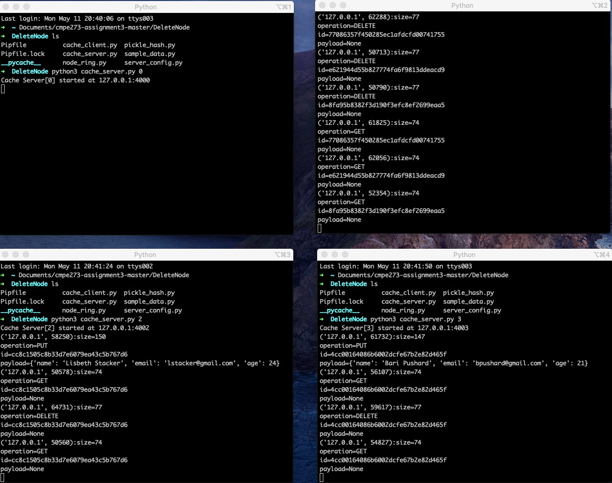
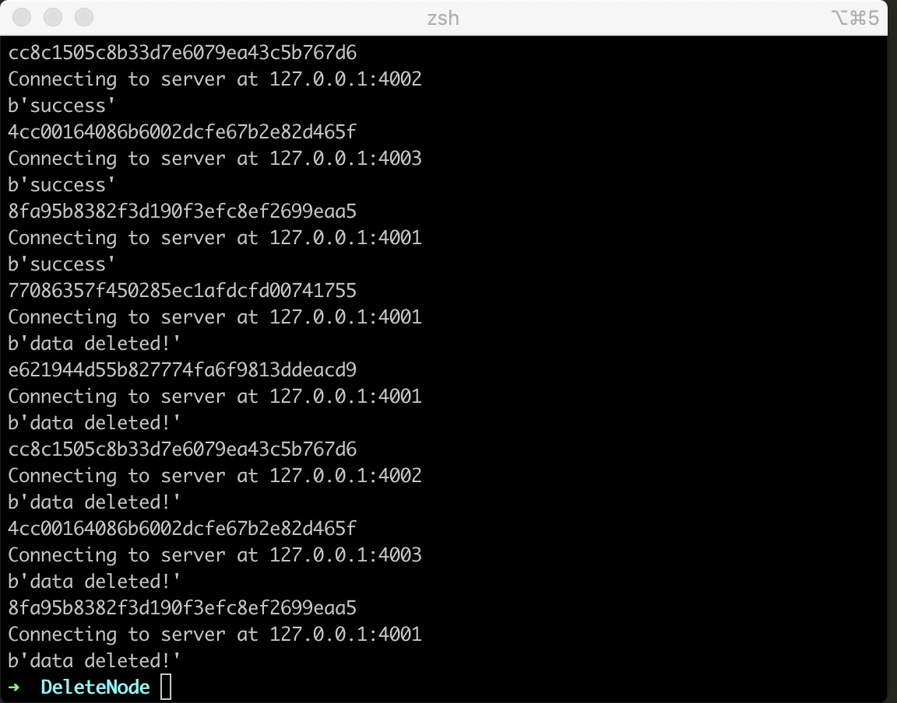
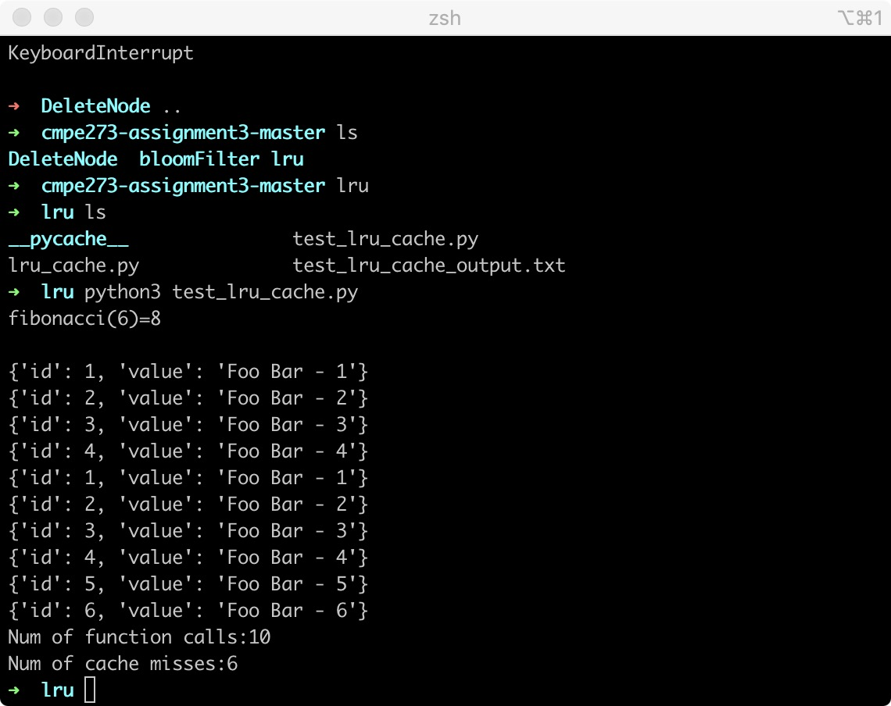
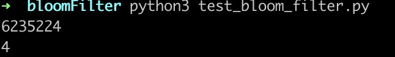
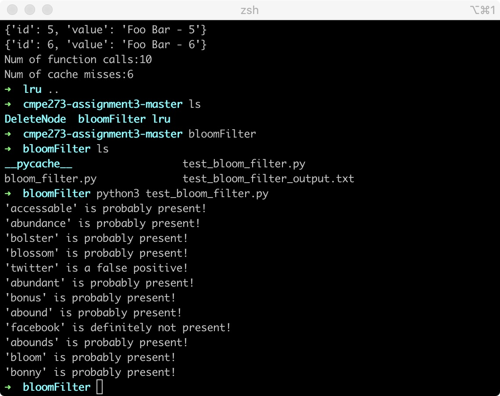

# cmpe273-assignment3

## 1. DELETE operation

### server output

### client output

## 2. LRU Cache

### output

## 3. Bloom Filter

>Answer the following question:

>What are the best k hashes and m bits values to store one million n keys (E.g. e52f43cd2c23bb2e6296153748382764) suppose we >use the same MD5 hash key from pickle_hash.py and explain why?

### Answers: the best k is 4 and m is 6235224
reason: m = - (n * log(p)) / (log(2)^2) ; 
        k = (m/n) * math.log(2) 
        

### output of Bloom Filter

